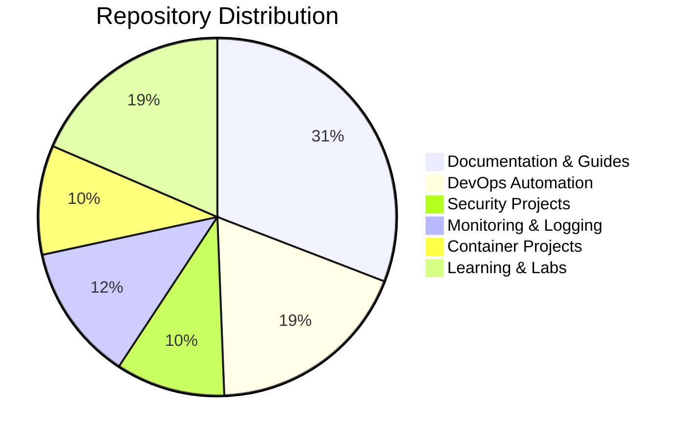

# Hello, World! 👋 I'm Saeed Marefat

[](https://www.linkedin.com/in/saeed-marefat-b97992349)
[]()
[]()

<p align="center">
  
</p>

## 🚀 About Me

```python
class DevSecOpsEngineer:
    def __init__(self):
        self.name = "Saeed Marefat"
        self.role = "DevOps & DevSecOps Engineer"
        self.location = "Iran"
        self.philosophy = "Shift Security Left in DevOps Pipeline"
        self.current_focus = [
            "Security Automation & Compliance",
            "Cloud-Native Security",
            "Infrastructure as Code Security",
            "Container Security & Hardening",
            "CI/CD Security Pipelines"
        ]
    
    def mission(self):
        return "Building secure, scalable, and reliable infrastructure with security baked into every layer"
        
me = DevSecOpsEngineer()
print(me.mission())
```

## 🛠️ Tech Stack & DevSecOps Toolkit

### 🔒 **Security & Compliance**


### 🔧 **Core DevOps & IaC**


### ☁️ **Cloud & Infrastructure**


### 📜 **Scripting & Automation**


### 📊 **Monitoring & Observability**


### 🗃️ **Databases & Storage**


### 🔍 **Learning & Exploring**


## 📈 GitHub Stats

<p align="center">
  
  
</p>

## 🏆 Featured Projects & Production Systems

### 📚 **Comprehensive DevOps Documentation Hub**
[](https://github.com/saeedmfat/saeed-devops-docs)
> **A unified knowledge base** combining 20+ technical guides into organized categories:
> - **Containerization**: LXC/LXD, Docker, Linux Namespaces
> - **Kubernetes & GitOps**: ArgoCD, kubeconfig, security
> - **Linux System**: systemd, journalctl, iptables
> - **Virtualization**: KVM vs VirtualBox, Home Lab setup

### 🔄 **Production-Grade CI/CD GitOps Platform**
[](https://github.com/saeedmfat/Production-Grade-simulation-CI-CD-GitOps-Platform-for-Resource-Constrained-Home-Labs)
> **Simulated production environment** with full GitOps workflow for resource-constrained home labs. Features automated deployments, security scanning, and monitoring integration.

### ⚙️ **Configuration Drift Detection & Remediation**
[](https://github.com/saeedmfat/ansible-Configuration-Drift-Detection-and-Self-Remediation-Platform)
> **Self-healing infrastructure** using Ansible to detect and automatically remediate configuration drift. Implements security compliance and automated enforcement.

### 📊 **Real-Time Log Monitoring & Alerting**
[](https://github.com/saeedmfat/Real-Time-Log-Monitoring-and-Alerting-Platform)
> **Comprehensive observability platform** with log aggregation, real-time alerting, and visualization using modern monitoring tools.

### 🐳 **Containerized Applications**
[](https://github.com/saeedmfat?tab=repositories&q=docker&type=&language=&sort=)
> **Production-ready containerized applications** including:
> - [MBTI Personality Test App](https://github.com/saeedmfat/dockerize-mbti-app) - Flask app with Docker
> - [Destiny Matrix Chart](https://github.com/saeedmfat/dockerized-destiny-matrix-chart-app) - Numerology app
> - [Flask Docker App](https://github.com/saeedmfat/flask-docker-app) - Scalable web application

## 📊 Repository Categories Breakdown

### 🔧 **DevOps & Automation** (15+ repos)
- **CI/CD**: GitHub Actions, Jenkins pipelines, automated testing
- **Infrastructure as Code**: Terraform, Ansible playbooks
- **Configuration Management**: Automated provisioning and management

### 🛡️ **Security & Compliance** (8+ repos)
- **Security Automation**: SAST, DAST, secret scanning
- **Policy Enforcement**: OPA policies, compliance checking
- **Container Security**: Image scanning, runtime protection

### 📈 **Monitoring & Observability** (10+ repos)
- **Metrics Collection**: Prometheus exporters, custom metrics
- **Log Management**: Centralized logging, log analysis
- **Alerting**: Multi-channel notifications, escalation policies

### 🐧 **Linux & System Administration** (12+ repos)
- **System Automation**: Bash scripting, cron jobs, systemd services
- **Networking**: iptables, nginx configuration, network troubleshooting
- **Performance**: Tuning, benchmarking, optimization

### 🎓 **Learning & Documentation** (20+ repos)
- **Structured Guides**: Roadmaps, terminology cheatsheets
- **Practical Labs**: Hands-on exercises, real-world scenarios
- **Troubleshooting**: Common issues and solutions

## 🏗️ Recent Project Highlights

| Project | Technology Stack | Status | Description |
|---------|-----------------|--------|-------------|
| **saeed-devops-docs** | Markdown, Git, Documentation | 🟢 **Active** | Consolidated documentation hub with 20+ technical guides |
| **Production CI/CD Platform** | Kubernetes, ArgoCD, GitOps | 🟡 **In Progress** | Full GitOps workflow simulation for home labs |
| **Resume as Infrastructure** | Terraform, AWS, CI/CD | 🟢 **Active** | Personal resume deployed as automated infrastructure |
| **Log Monitoring Platform** | Loki, Grafana, Prometheus | 🟢 **Active** | Real-time log aggregation and alerting system |
| **Ansible Security Platform** | Ansible, Python, Security | 🟢 **Active** | Automated configuration drift detection and remediation |

## 📈 Project Statistics



- **Total Public Repositories**: 37
- **Active Maintenance**: 90% of repositories
- **Documentation Coverage**: 100%
- **Last Updated**: Within last month

## 📫 Connect With Me

[](https://www.linkedin.com/in/saeed-marefat-b97992349)
[](https://github.com/saeedmfat)
[](mailto:saeedmarefatofficial@gmail.com)
[](https://github.com/saeedmfat)

## 💡 DevOps Philosophy

> **"Security isn't a feature, it's a fundamental property of the system."**  
> My approach integrates security throughout the DevOps lifecycle, from code commit to production deployment.

## 🔗 Quick Links

- **[📚 Complete Documentation Hub](https://github.com/saeedmfat/saeed-devops-docs)** - All my technical guides in one place
- **[🚀 Production Projects](https://github.com/saeedmfat?tab=repositories&q=production&type=&language=&sort=)** - Real-world DevOps implementations
- **[🛡️ Security Focus](https://github.com/saeedmfat?tab=repositories&q=security&type=&language=&sort=)** - DevSecOps tools and practices
- **[📊 Monitoring Stack](https://github.com/saeedmfat?tab=repositories&q=monitoring&type=&language=&sort=)** - Observability and logging solutions

---

<div align="center">

### 📊 Repository Metrics
[](https://github.com/saeedmfat?tab=repositories)
[]()
[]()
[]()

</div>

<p align="center">
  
  
</p>

---

*"Automating infrastructure with security at its core"*  
*Last Updated: $(date +%Y-%m-%d)* | *Total Projects: 37* | *Active: 33*
