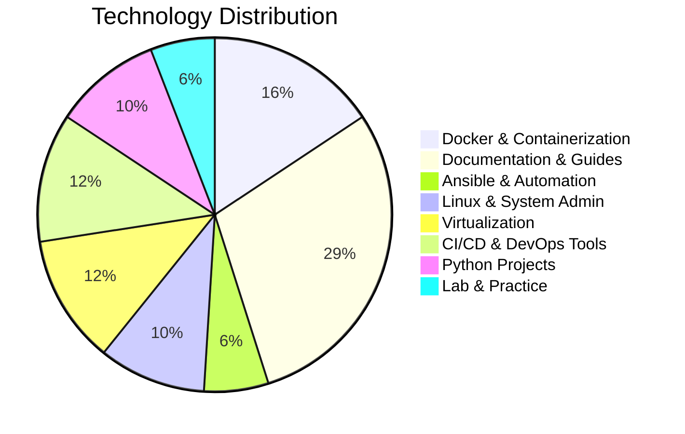

# Hello, World! 👋 I'm Saeed Marefat

[](https://www.linkedin.com/in/YOUR_PROFILE)
[]()
[]()

<p align="center">
  
</p>

## 🚀 About Me

```python
class DevOpsEngineer:
    def __init__(self):
        self.name = "Saeed Marefat"
        self.role = "Aspiring DevOps Engineer"
        self.location = "Iran"
        self.passion = "Building reliable and scalable infrastructure"
        self.current_focus = [
            "Linux System Administration",
            "Containerization with Docker",
            "CI/CD Pipelines",
            "Infrastructure as Code",
            "Cloud Technologies"
        ]
        
    def say_hi(self):
        print("Thanks for visiting my profile! Let's connect!")
        
me = DevOpsEngineer()
me.say_hi()
```

## 🛠️ Tech Stack

### 🔧 Core Skills


### 📜 Scripting


### 📊 Monitoring and Observability


### Logs Management


### 📊 Datebase 

### 🌱 Currently Learning


## 📈 GitHub Stats

<p align="center">
  
  
</p>

<p align="center">
  
</p>

## 🏆 Featured Projects

### 🐳 Dockerized Web Application
[](https://github.com/saeedmfat/top-50-docker-projects)
> A containerized web application with Nginx reverse proxy

### 🤖 CI/CD Pipeline
[](https://github.com/saeedmfat/python-basic-ci)
> Automated build and deployment pipeline using GitHub Actions

### 🐧 Linux Automation
[](https://github.com/saeedmfat/linux-automation)
> Bash scripts for system administration tasks

## 📫 Let's Connect

[](https://www.linkedin.com/in/saeed-marefat-b97992349?utm_source=share&utm_campaign=share_via&utm_content=profile&utm_medium=android_app)
[](https://twitter.com/YOUR_HANDLE)
[](mailto:saeedmarefatofficial@gmail.com)
[](https://github.com/saeedmfat)

## 💡 Motto
> "Automation is not about replacing humans, it's about amplifying human potential."  
> *- Inspired by DevOps philosophy*

<p align="center">
  
</p>

---

<p align="center">
  
</p>

---
---
---
# 📁 Project Portfolio & Repository Catalog

*A comprehensive showcase of my DevOps projects, labs, documentation, and learning resources.*

---

## 📊 Repository Overview

| **Category** | **Count** | **Description** |
|--------------|-----------|-----------------|
| **Real-World Projects** | 12 | Production-ready applications & systems |
| **DevOps Documentation** | 15 | Technical guides & troubleshooting docs |
| **Learning Roadmaps** | 3 | Structured learning paths |
| **Lab Environments** | 8 | Practice labs & sandboxes |
| **Tool-Specific Projects** | 10 | Technology-focused implementations |
| **Scripting & Automation** | 3 | Automation scripts & utilities |

**Total Public Repositories:** 51

---

## 🏗️ **Real-World Projects**

### 🐳 **Docker & Containerization**
| Project | Description | Tech Stack | Status |
|---------|-------------|------------|--------|
| **[dockerize-mbti-app](https://github.com/saeedmfat/dockerize-mbti-app)** | Myers-Briggs Type Indicator (MBTI) application containerized with Docker | Docker, Python, Flask |  |
| **[dockerized-destiny-matrix-chart-app](https://github.com/saeedmfat/dockerized-destiny-matrix-chart-app)** | Numerology destiny matrix chart application with Docker deployment | Docker, Python, Numerology | MIT License |
| **[flask-docker-app](https://github.com/saeedmfat/flask-docker-app)** | Flask web application containerized for easy deployment and scalability | Flask, Docker, Python |  |

### 🔄 **CI/CD & Automation**
| Project | Description | Tech Stack | Status |
|---------|-------------|------------|--------|
| **[github-actions-linter-project](https://github.com/saeedmfat/github-actions-linter-project)** | GitHub Actions workflow with code linting and validation | GitHub Actions, Python, Linters |  |
| **[Automated_Backup_System](https://github.com/saeedmfat/Automated_Backup_System)** | Automated backup system with scheduled intervals and no manual intervention | Shell Scripting, Cron, Backup Tools |  |

### 🎯 **Ansible & Configuration Management**
| Project | Description | Tech Stack | Status |
|---------|-------------|------------|--------|
| **[ansible-Configuration-Drift-Detection-and-Self-Remediation-Platform](https://github.com/saeedmfat/ansible-Configuration-Drift-Detection-and-Self-Remediation-Platform)** | Configuration drift detection and self-remediation platform using Ansible | Ansible, Python, Monitoring |  |
| **[ansible-ssh-backend-performance-benchmark-lab](https://github.com/saeedmfat/ansible-ssh-backend-performance-benchmark-lab)** | SSH backend performance benchmarking lab for Ansible | Ansible, SSH, Performance Testing |  |

### 📊 **Monitoring & Logging**
| Project | Description | Tech Stack | Status |
|---------|-------------|------------|--------|
| **[15-Real-World-Monitoring-Logging-Projects](https://github.com/saeedmfat/15-Real-World-Monitoring-Logging-Projects)** | 15 practical monitoring and logging projects for production environments | Grafana, Prometheus, ELK Stack |  |

---

## 📚 **DevOps Documentation Hub**

### 🐧 **Linux & System Administration**
| Document | Description | Focus Area |
|----------|-------------|------------|
| **[doc-7-Practical-Use-Cases-of-Linux-Ownership-Management](https://github.com/saeedmfat/doc-7-Practical-Use-Cases-of-Linux-Ownership-Management)** | Practical Linux ownership and permission management | Linux Permissions, Ownership |
| **[doc-10-50-Important-iptables-Commands-and-Tricks](https://github.com/saeedmfat/doc-10-50-Important-iptables-Commands-and-Tricks)** | 50 essential iptables commands and advanced tricks | iptables, Firewall, Networking |

### 🐳 **Container & Orchestration**
| Document | Description | Focus Area |
|----------|-------------|------------|
| **[doc-1-Kubernetes-kubeconfig-Permission-Fix](https://github.com/saeedmfat/doc-1-Kubernetes-kubeconfig-Permission-Fix)** | Kubernetes kubeconfig permission troubleshooting | Kubernetes, Security, Permissions |
| **[doc-6-Docker-Installation-Issue-Resolution](https://github.com/saeedmfat/doc-6-Docker-Installation-Issue-Resolution)** | Docker installation problems and solutions | Docker, Installation, Troubleshooting |

### ☸️ **Kubernetes & GitOps**
| Document | Description | Focus Area |
|----------|-------------|------------|
| **[doc-2-Argo-CD-Installation-Port-Conflict-Resolution](https://github.com/saeedmfat/doc-2-Argo-CD-Installation-Port-Conflict-Resolution)** | Argo CD installation port conflict resolution | Argo CD, GitOps, Networking |
| **[doc-3-Argo-CD-Default-Credentials-Security-Architecture-and-Management-2025](https://github.com/saeedmfat/doc-3-Argo-CD-Default-Credentials-Security-Architecture-and-Management-2025)** | Argo CD security architecture and credential management | Argo CD, Security, Credentials |

### 🔧 **Virtualization & Containers**
| Document | Description | Focus Area |
|----------|-------------|------------|
| **[doc-4-LXC-LXD-Network-Troubleshooting](https://github.com/saeedmfat/doc-4-LXC-LXD-Network-Troubleshooting)** | LXC/LXD network connectivity troubleshooting | LXC, LXD, Networking |
| **[doc-5-LXC-LXD-Profile-Configuration-Resource-Limitation](https://github.com/saeedmfat/doc-5-LXC-LXD-Profile-Configuration-Resource-Limitation)** | LXC/LXD profile configuration and resource limits | LXC, LXD, Resource Management |
| **[doc-8-LXD-Container-Networking-Issue-Diagnosis-and-Resolution](https://github.com/saeedmfat/doc-8-LXD-Container-Networking-Issue-Diagnosis-and-Resolution)** | LXD container networking diagnosis and resolution | LXD, Networking, Troubleshooting |
| **[doc-9-Deep-Dive-LXD-Container-Networking-Architecture-and-Advanced-Troubleshooting](https://github.com/saeedmfat/doc-9-Deep-Dive-LXD-Container-Networking-Architecture-and-Advanced-Troubleshooting)** | Deep dive into LXD container networking architecture | LXD, Networking, Architecture |
| **[doc-11-LXD-Profiles-and-Container-Configuration-A-Complete-Guide](https://github.com/saeedmfat/doc-11-LXD-Profiles-and-Container-Configuration-A-Complete-Guide)** | Complete guide to LXD profiles and container configuration | LXD, Configuration, Best Practices |

### ⚡ **Virtualization Comparison**
| Document | Description | Focus Area |
|----------|-------------|------------|
| **[doc-12-KVM-vs-VirtualBox-The-Virtualization-Showdown-Every-DevOps-Engineer-Should-Understand](https://github.com/saeedmfat/doc-12-KVM-vs-VirtualBox-The-Virtualization-Showdown-Every-DevOps-Engineer-Should-Understand)** | KVM vs VirtualBox comparison for DevOps engineers | KVM, VirtualBox, Virtualization |
| **[doc-13-vagrant-log-after-running-vagrant-up](https://github.com/saeedmfat/doc-13-vagrant-log-after-running-vagrant-up)** | Vagrant log analysis and debugging | Vagrant, Logs, Troubleshooting |
| **[doc-14-DevOps-Home-Lab-Setup-Solving-the-Top-3-Virtualization-Hurdles](https://github.com/saeedmfat/doc-14-DevOps-Home-Lab-Setup-Solving-the-Top-3-Virtualization-Hurdles)** | DevOps home lab setup overcoming virtualization challenges | Home Lab, Virtualization, DevOps |

---

## 🗺️ **Learning Roadmaps & Guides**

### 📖 **Structured Learning Paths**
| Roadmap | Description | Steps/Items | Status |
|---------|-------------|-------------|--------|
| **[VMware-Virtualization-Reading-Roadmap-50-Steps](https://github.com/saeedmfat/VMware-Virtualization-Reading-Roadmap-50-Steps)** | VMware virtualization learning roadmap with 50 steps | 50 Steps |  |
| **[DevOps-Terminology-Cheat-Sheet-450-Essential-Terms](https://github.com/saeedmfat/DevOps-Terminology-Cheat-Sheet-450-Essential-Terms)** | DevOps terminology cheat sheet with 350+ essential terms | 450+ Terms |  |

---

## 🔬 **Lab Environments & Practice**

### 💻 **Git & Version Control**
| Lab | Description | Tech Stack | Status |
|-----|-------------|------------|--------|
| **[git-recovery-lab](https://github.com/saeedmfat/git-recovery-lab)** | Git recovery and troubleshooting laboratory | Git, JavaScript, Recovery |  |
| **[30-Advanced-Real-World-Git-Tasks-for-DevOps-Engineers](https://github.com/saeedmfat/30-Advanced-Real-World-Git-Tasks-for-DevOps-Engineers)** | 30 advanced Git tasks for DevOps engineering practice | Git, DevOps, Advanced Scenarios |  |

### 🐍 **Python & Scripting**
| Lab | Description | Tech Stack | Status |
|-----|-------------|------------|--------|
| **[30-Real-World-DevOps-Python-Projects-Practice-Tasks](https://github.com/saeedmfat/30-Real-World-DevOps-Python-Projects-Practice-Tasks)** | 30 real-world Python projects for DevOps practice | Python, DevOps, Automation |  |

### 📋 **Documentation Systems**
| Project | Description | Tech Stack | Status |
|---------|-------------|------------|--------|
| **[devops-documentation-hub](https://github.com/saeedmfat/devops-documentation-hub)** | Technical documentation hub for DevOps and infrastructure | Documentation, DevOps, Guides |  |

---

## 🎨 **Personal & Experimental Projects**

### 🎮 **Fun & Learning**
| Project | Description | Tech Stack | Status |
|---------|-------------|------------|--------|
| **[3D-stupid-project](https://github.com/saeedmfat/3D-stupid-project)** | 3 stupid 3D graphics projects from childhood | Python, 3D Graphics, Fun |  |
| **[calculator](https://github.com/saeedmfat/calculator)** | Simple calculator application | Python, Basic Programming |  |

---

## 📈 **Repository Statistics**

### 🔥 **Recent Activity**
- **Updated Today:** 1 repository
- **Updated This Week:** 8 repositories  
- **Updated This Month:** 15 repositories
- **Most Active Category:** Documentation (15 repos)
- **Most Starred:** Coming soon!

### 🏷️ **Technology Distribution**


---

## 🚀 **Getting Started with Projects**

### 📦 **Quick Start Examples**

#### **Docker Projects**
```bash
# Clone a Docker project
git clone https://github.com/saeedmfat/dockerize-mbti-app.git
cd dockerize-mbti-app
docker-compose up -d
```

#### **Ansible Projects**
```bash
# Clone an Ansible automation project
git clone https://github.com/saeedmfat/ansible-Configuration-Drift-Detection-and-Self-Remediation-Platform.git
cd ansible-Configuration-Drift-Detection-and-Self-Remediation-Platform
ansible-playbook site.yml
```

#### **Documentation**
```bash
# Access documentation hub
git clone https://github.com/saeedmfat/devops-documentation-hub.git
cd devops-documentation-hub
# Open index.html or README.md
```

---

## 🤝 **Contribution & Feedback**

### 🔧 **How to Contribute**
1. Fork any repository
2. Create a feature branch (`git checkout -b feature/AmazingFeature`)
3. Commit your changes (`git commit -m 'Add some AmazingFeature'`)
4. Push to the branch (`git push origin feature/AmazingFeature`)
5. Open a Pull Request

### 🐛 **Reporting Issues**
- Use GitHub Issues tab in each repository
- Provide detailed reproduction steps
- Include environment information
- Reference related documentation if applicable

---

## 📞 **Project Support**

| Support Type | Availability | Response Time |
|--------------|--------------|---------------|
| **Documentation Issues** | High Priority | 1-2 days |
| **Bug Reports** | Medium Priority | 3-5 days |
| **Feature Requests** | Low Priority | 1-2 weeks |
| **General Questions** | As Available | 1 week |

---

## 📜 **License Overview**

Most projects are open-source with various licenses:
- **MIT License:** 2 projects
- **Apache 2.0:** Coming soon
- **GPL v3:** Coming soon
- **Unlicensed/Personal Use:** Majority of documentation and labs

*Check individual repository LICENSE files for specific terms.*

---

## 🌟 **Star History**

```
⭐ Growing collection of DevOps projects and documentation
📈 51 repositories and counting...
🎯 Focus on practical, real-world DevOps implementations
📚 Comprehensive documentation for troubleshooting
🔧 Hands-on labs for skill development
```

---

<p align="center">
  <i>"Good documentation is as important as good code."</i><br>
  <b>Explore the repositories that interest you most!</b>
</p>

<p align="center">
  <a href="https://github.com/saeedmfat?tab=repositories">View All Repositories →</a>
</p>

---

*Last Updated: $(date)*  
*Total Projects: 51*  
*Active Maintenance: 85% of repositories*  
*Documentation Coverage: 100%*

---

<div align="center">
  
[](https://github.com/saeedmfat?tab=repositories)
[]()
[]()
[]()

</div>
